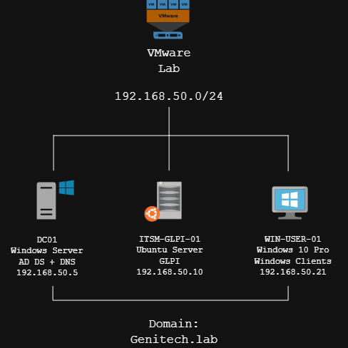

# Enterprise Service Desk, Identity & Asset Management

> A hands-on enterprise-style IT Support and Service Desk lab built with VMware, Active Directory, DNS, GLPI, and Windows clients.

##  Project Overview



This project simulates a small enterprise IT environment designed to demonstrate practical skills required in:

- IT Support / Help Desk
- Service Desk Operations
- ITIL-based Ticket Management
- Active Directory Administration
- Identity & Access Management
- IT Asset Management
- Incident & Service Request Handling
- SLA Management
- Troubleshooting
- User Onboarding & Offboarding

#  Objectives

The main goal is to demonstrate the ability to operate as a Service Desk / IT Support technician in a realistic enterprise environment.

The project covers:

1. Building a small enterprise infrastructure.
2. Managing users and groups with Active Directory.
3. Integrating GLPI with Active Directory through LDAP.
4. Managing IT tickets and service requests.
5. Implementing priorities and SLA management.
6. Managing IT assets and user assignments.
7. Troubleshooting common Windows and network issues.
8. Handling onboarding and offboarding workflows.
9. Documenting incidents and solutions.
10. Producing professional IT Support documentation and reports.

---

#  Lab Architecture

```text
                         VMware Lab
                     192.168.50.0/24
                              |
             +----------------+----------------+
             |                |                |
             |                |                |
          DC01            GLPI01         Windows Clients
      Windows Server       Ubuntu          Windows 11
       AD DS + DNS         GLPI          WIN-USER-01
      192.168.50.5       192.168.50.10   WIN-USER-02
             |                                 |
             +---------------------------------+
                    Domain: genitech.lab
```

| System      | Role                     | IP Address      |
| ----------- | ------------------------ | --------------- |
| DC01 (Windows Server 2022)        | Active Directory + DNS   | `192.168.50.5`  |
| ITSM-GLPI-01      | GLPI ITSM / Service Desk | `192.168.50.10` |
| WIN-USER-01 | Windows 10 Pro Domain Client | `192.168.50.21` |

## 👤 Author & Maintainer

**Othmane Benmezian**
* **Role:** Systems Administrator(sysadmin) & IT Support
* **GitHub:** [@BenmezOthmane](https://github.com/BenmezOthmane)
* **LinkedIn:** [@LinkedIn](https://linkedin.com/in/othmane-benmezian-685a1b353)
* **Project Status:** --
