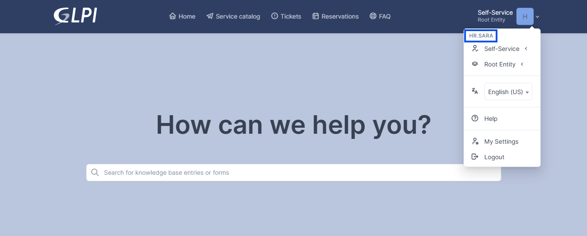
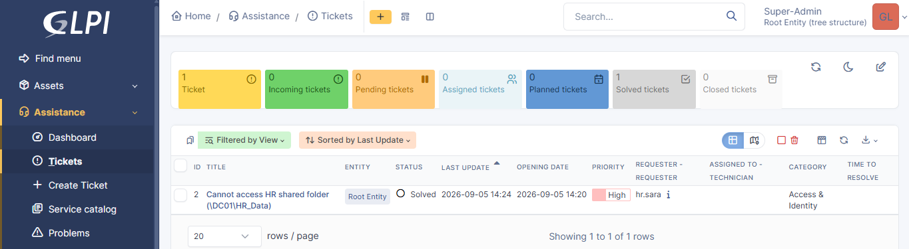
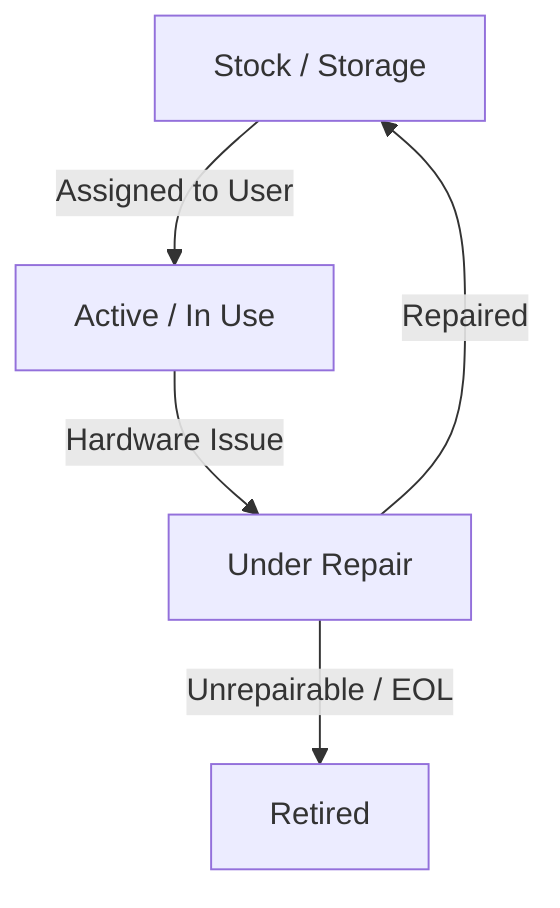
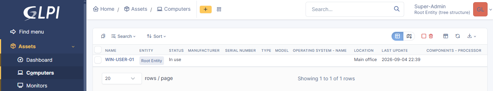
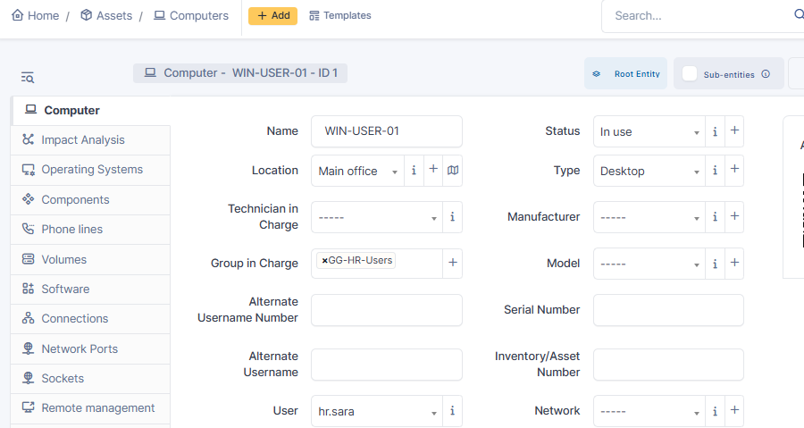
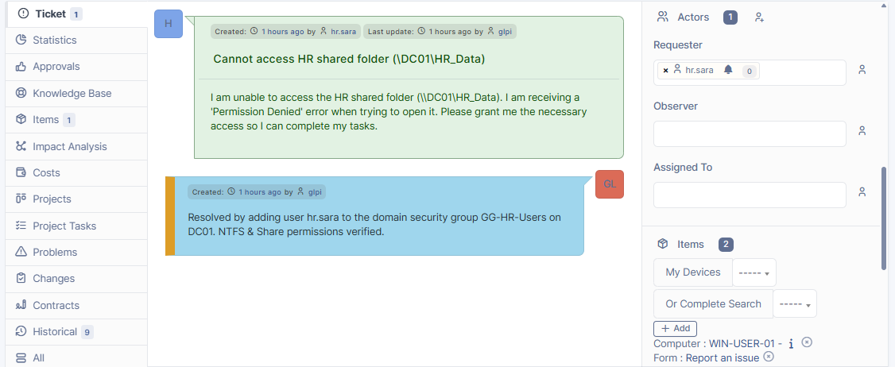

## Active Directory User Management & Administration

### 1. User Creation Process
1. Open **Active Directory Users and Computers** (`dsa.msc`) on `DC01`.
2. Navigate to the target OU (e.g., `genitech.lab/Genitech/Users/HR`).
3. Right-click the OU -> **New** -> **User**.
4. Enter user details (First Name, Last Name, User Principal Name e.g., `hr.sara`).
5. Set initial secure password and check **"User must change password at next logon"**.
6. Click **Finish**.

### 2. Password Reset Procedure
1. Locate user account in `dsa.msc`.
2. Right-click the user -> **Reset Password**.
3. Enter new temporary password and confirm.
4. Check **"User must change password at next logon"**.
5. Uncheck **"Unlock the user's account"** (unless locked) and click **OK**.

### 3. Account Unlock Procedure
1. Locate the locked account in `dsa.msc`.
2. Right-click the user -> **Properties** -> Select **Account** tab.
3. Check the box **"Unlock account. This account is currently locked out on this Active Directory Domain Controller."**
4. Click **Apply** and **OK**.

### 4. Adding User to Security Group
1. Locate the user in `dsa.msc`.
2. Right-click the user -> **Add to a group...**
3. Type the group name (e.g., `GG-HR-Users`) and click **Check Names**.
4. Click **OK** upon successful validation.
5. Alternatively, open group properties -> **Members** tab -> **Add** -> Select user account.

---

## Incident Management Operations & Ticket Lifecycle (ITIL v4)

### 1. How an Incident is Created
1. Domain users access the GLPI Self-Service Portal (`http://<GLPI_IP>`) using their Active Directory domain credentials (`genitech.lab`).
2. Verify access to portal.

3. Click **Create a ticket** from the main dashboard.
4. Fill in the required fields:
   * **Category:** Select the relevant IT service category (e.g., `Access & Identity`).
   * **Urgency:** Define how urgently a resolution is needed.
   * **Title & Description:** Describe the issue clearly in first-person context (e.g., *I am unable to access the HR shared folder...*).
5. Click **Submit ticket** to generate a unique Ticket ID (e.g., `INC-003`).

### 2. How Priority is Determined
Priority is calculated automatically within GLPI by matching **Impact** against **Urgency** using the ITIL Matrix:
* **Impact:** Evaluates how many users or systems are affected (e.g., Single User, Department, Organization).
* **Urgency:** Evaluates how quickly the business requires a resolution.
* **Matrix Mapping:**
  * High Urgency + Single User Impact = **P2 (High) / P3 (Medium)**
  * High Urgency + Enterprise Outage = **P1 (Critical)**

### 3. Escalation Policy (L1 to L2 Escalation Trigger)
* **L1 Support Scope:** Handles initial logging, categorization, basic troubleshooting, and standard account unlocks.
* **L2 Escalation Criteria:** A ticket is escalated to L2 (Tier-2 SysAdmins) when:
  * The issue requires Active Directory domain administrative privileges (e.g., updating security group memberships like `GG-HR-Users` on `DC01`).
  * Advanced infrastructure troubleshooting is needed (e.g., NTFS & Share permissions, GPO conflicts, network path validation).
  * The L1 service desk exceeds 30 minutes without reaching a diagnostic breakthrough.

### 4. Ticket Resolution, Verification & Closure
1. **Executing the Fix:** L2 Support performs the necessary resolution on the infrastructure (e.g., adding user `hr.sara` to `GG-HR-Users` on `DC01`).
2. **Technical Verification:** L2 verifies access propagation on the shared folder (`\\DC01\HR_Data`) to confirm the issue is fixed.
3. **Documenting Solution:** The technician navigates to the **Solution** tab in GLPI, inputs a concise explanation of the technical action taken, and saves the entry.
4. **Closing the Ticket:** GLPI sets the ticket status to **Solved**. Once the end-user verifies that service is restored, the status updates to **Closed**.

## IT Asset Management (ITAM) Operations

### 1. Asset Lifecycle Management
Assets transition through ITIL operational states:
`Available` ➔ `Assigned (In Use)` ➔ `Under Repair` ➔ `Retired

### 2. Hardware Provisioning Workflow (New Hire Onboarding)
1. Locate workstation in GLPI inventory with status `Available`.
2. Update record status to `In Use`, assign user (`hr.sara`), group (`GG-HR-Users`), and physical location (`Main Office`).

### 3. Incident Mapping (Linking Tickets to Assets)
1. Open active ticket in GLPI Service Desk.
2. Under **Items / Elements**, add asset type `Computer` and select `WIN-USER-01`.
3. Ensures complete audit trail between hardware reliability and user tickets.

