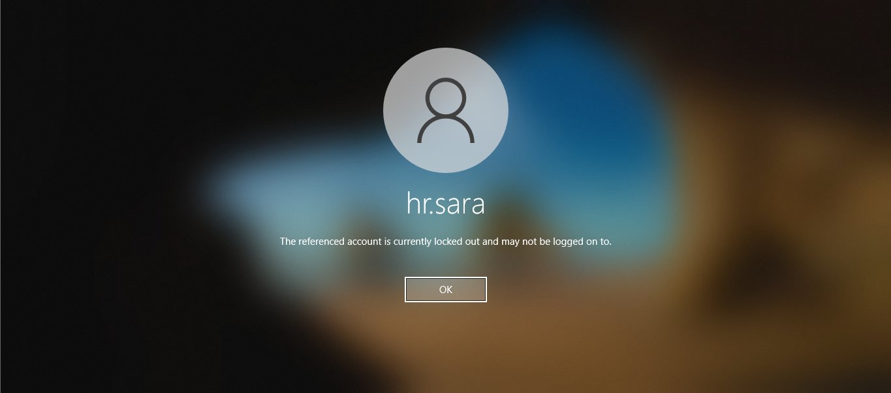
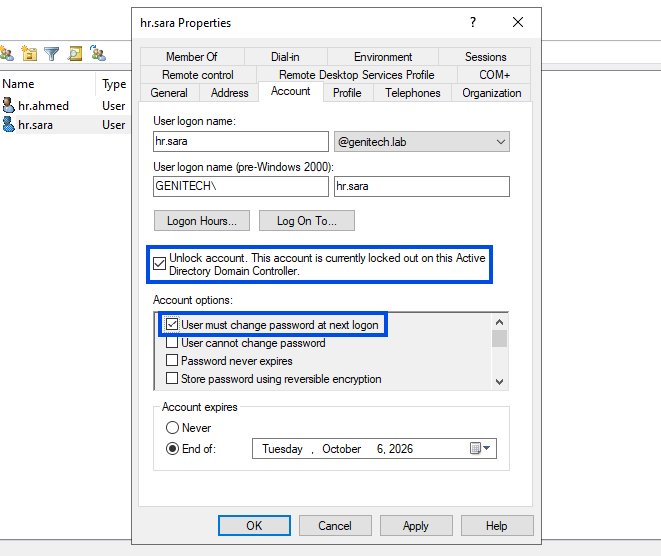
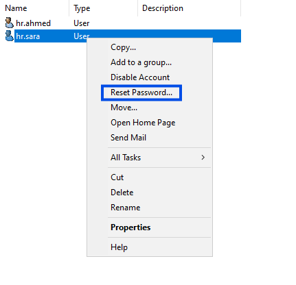
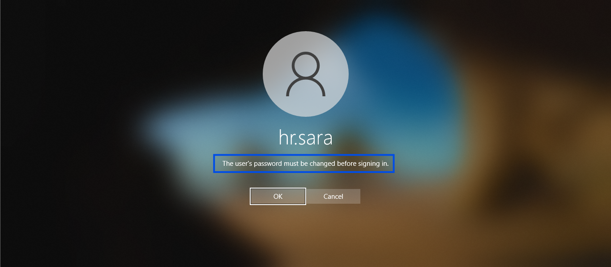

# INC-001: Account Lockout & Password Reset Procedures

## Executive Summary
* **Incident ID:** INC-001
* **Ticket Reference (GLPI):** #3
* **Category:** Access & Identity Management
* **Target User:** `hr.sara`
* **Affected Workstation:** `WIN-USER-01`
* **Severity / Priority:** Medium (P3)
* **ITIL v4 Lifecycle Phase:** Incident Management — Resolution & Closure

---

## 1. Incident Description & Detection
The user `hr.sara` reported an inability to log into workstation `WIN-USER-01`. Upon entry of credentials, Windows displayed an explicit domain account lockout message. 

* **Symptom:** User unable to authenticate at the interactive logon screen.
* **Root Cause Analysis (RCA):** The user exceeded the 5-failed-login threshold configured via Active Directory Group Policy (`Account Lockout Policy`), triggering an automatic security isolation.

---

## 2. Technical Evidence

### Problem Identification

*Figure 1: Workstation notification confirming domain account lock status after multiple invalid authentication attempts.*

### Resolution & Password Change Requirement

*Figures 2,3,4: Successful authentication following domain controller unlock and temporary credential reset, enforcing immediate password change.*

---

## 3. Remediation & Workflow Executed

1. **Ticket Creation (GLPI):** Logged incident under `Access & Identity`, assigned to `it.adam` with target item linked to `WIN-USER-01`.
2. **Active Directory Management (`DC01`):**
   * Navigated to `Active Directory Users and Computers` (`dsa.msc`).
   * Located `hr.sara` account properties and cleared the **Unlock account** flag.
   * Performed a forced password reset with temporary credentials.
   * Flagged **User must change password at next logon** to respect security baselines.
3. **End-User Validation (`WIN-USER-01`):** User authenticated using temporary credentials, successfully updated the password, and gained access to the desktop environment.
4. **GLPI Closure:** Solution documented and ticket status updated to **Solved** / **Closed**.

---

## 4. Post-Incident Recommendations
* Educate end-users regarding credential management to prevent threshold-triggered lockouts.
* Ensure caps-lock status visibility on client logon screens to minimize user typo rates.
