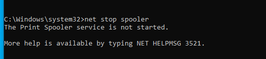
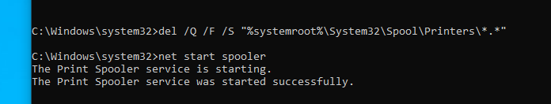

# INC-005: Network Printer Offline due to Print Spooler Service Failure

## Executive Summary
* **Incident ID:** INC-005
* **Ticket Reference (GLPI):** #7
* **Category:** Hardware / Printers
* **Requester:** `hr.sara`
* **Target Workstation:** `WIN-USER-01`
* **Severity / Priority:** Medium (P3)
* **ITIL v4 Lifecycle Phase:** Incident Management — Restoration of Service

---

## 1. Incident Description & Detection
User `hr.sara` reported an inability to print HR documents from workstation `WIN-USER-01`.

* **Symptom:** Print jobs failed to send, and the local print queue remained non-responsive.
* **Root Cause Analysis (RCA):** The local Windows `Print Spooler` service (`spoolsv.exe`) stopped unexpectedly, halting all print operations across the endpoint.

---

## 2. Technical Evidence

### Problem Identification

*Figure 1: Confirmation that the Print Spooler service is stopped via Command Prompt.*

### Resolution Validation

*Figure 2: Clearing corrupt spool queue files and successfully restarting the Print Spooler service.*

---

## 3. Remediation & Workflow Executed

1. **Ticket Logging (GLPI):** Registered ticket under `Hardware / Printers`, assigned to `it.adam`.
2. **Service Diagnostic (`WIN-USER-01`):**
   * Confirmed service status was stopped using `net stop spooler`.
3. **Remediation Commands:**
   * Purged stuck spool files: `del /Q /F /S "%systemroot%\System32\Spool\Printers\*.*"`
   * Started the Print Spooler service: `net start spooler`
4. **Validation:** Confirmed `The Print Spooler service was started successfully` output in CMD and verified print queue normalization.
5. **GLPI Closure:** Documented steps taken and updated ticket status to **Solved**.

---

## 4. Post-Incident Recommendations
* Deploy a GPO or PowerShell background monitoring script to automatically detect and restart the `Print Spooler` service if it enters a stopped state.
